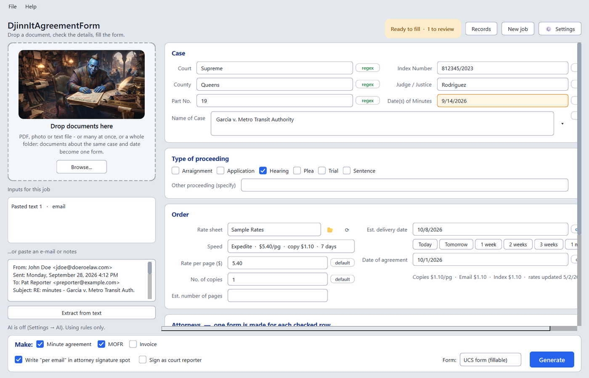

# DjinnItAgreementForm

A Windows app for New York court reporters. It fills in the UCS **Court Reporter Minute Agreement Form** (Private Party Transactions) and the **Minute Order Form/Receipt (MOFR)** for you, makes **invoices** from transcripts, and keeps a record of everything it made, with a dashboard of what you billed and what was paid.

Drop in a transcript, invoice, or photo of a court document, or paste an e-mail. The app finds the court, part, judge, case name, index number, dates, proceeding type and attorneys, shows everything for review, and saves a filled PDF.

**[Website](https://nono638.github.io/DjinnItAgreementForm/)  ·  [Download the installer](../../releases/latest)**



- **Works offline, and nothing leaves your computer.** Photos are read by the text recognition built into Windows. An AI helper is optional and runs locally too.
- **Asks when unsure.** Guesses are highlighted. When there are several candidates (two dates, several attorneys), you pick from a list. It asks about anything important that's missing before filling.
- **Remembers you.** Your name, address, phone and email are filled in on every form.
- **"Per email" option.** It can write "per email" on the attorney signature line, since minutes are often ordered by email.
- **Your signature.** Choose a photo or scan of your signature once (Settings → My info) and it is placed on the court reporter line of every form. The paper background is removed, so the form's line shows through.
- **Fewer keystrokes.** Default rate sheet, speed and number of copies are set once in Settings → Defaults. Buttons under the estimated delivery date fill in today, tomorrow, 1–3 weeks or 1 month from today.
- **Rate sheets.** Pick your price list (private, city, …) and delivery speed from dropdowns. The rate, delivery checkbox and estimated delivery date follow automatically.
- **One form per attorney.** Tick several attorneys to get a separate PDF for each.
- **Batches.** Drop many documents, or a whole folder, at once. Documents about the same case and date are combined, so each order gets one form.
- **Choose what to make:** tick *Minute agreement*, *MOFR* and/or *Invoice* at the bottom of the window. Your choice is remembered.
- **Invoices from transcripts.** Drop a transcript PDF and the invoice is priced from its page count and your rate sheet: one original, a copy (and e-mailed copy) for each ordering party, and an index for long transcripts, split between the parties. By default it lists Regular, Expedited and Daily so the attorney can choose ("choice" invoice), with your turnaround times and payment instructions (Settings → Invoice). Invoices need a transcript, because the page count is what's billed.
- **Records and dashboard.** Every file made is logged. **Records** (Ctrl+R) shows your invoices with totals billed, paid and outstanding, filtered by year, month, firm or status, broken down by firm and by month. Tick **Paid** when an invoice is paid, and say which speed they chose. Export a report (HTML), an Excel workbook or CSV files at any time.
- **Three agreement forms to choose from:** the court's own fillable UCS form (the default), a clean, re-typeset version of it (with room for a long case name, signature/date fields, fax and email), or the original 1999 scan.

## Install

1. Download `DjinnItAgreementForm-Setup-x.y.z.exe` from the [Releases](../../releases) page.
2. Run it. **No administrator rights are needed**; it installs just for you.
   - The installer isn't code-signed yet, so Windows may show "Windows protected your PC". Click **More info → Run anyway**.
3. On first launch, enter your details (name, address, phone, email). You can change them later in **Settings**.

**Requirements:** 64-bit Windows 10 (version 1809 or newer) or Windows 11, and about 200 MB of disk space. Nothing else needs installing: Python and all libraries are included, and no internet connection is needed. Reading photos and scanned PDFs uses Windows' text recognition, which needs the English language pack (normally already there). The optional AI helper needs [Ollama](https://ollama.com).

## Use

1. **Add the order:**
   - Drop a PDF (transcript, invoice, scanned document) or a photo onto the drop zone.
   - Or paste an e-mail into the text box and click **Extract from text**.
   - Or paste a screenshot with **Ctrl+V**.

   You can add several inputs for one job, and their results are combined.
2. **Check the fields.**
   - Each field has a badge showing where its value came from: **regex** (found in the document), **AI**, **default** (your settings), **derived** (calculated), or **you**.
   - Amber fields are guesses. A ▾ button lists other candidates.
3. **Pick the rate sheet and speed**, then tick the attorney(s) who ordered.
4. **Tick what to make** (minute agreement, MOFR, invoice), then **Generate** (Ctrl+Enter). The PDFs are saved next to your document, or to the folder chosen in Settings, and open automatically.

## Invoices and records

An invoice can be made when one of the job's inputs is a **transcript PDF**: its page count is billed (you can change it in *Est. number of pages*). One invoice is made for each ticked attorney, numbered 2026-0001, 2026-0002, … (the format is in Settings → Invoice). The footer shows the prices before you generate, and lets you change the number of ordering parties or bill a single speed instead of offering every speed.

The price of each speed, per page of the transcript, is:

| Line | Charged |
|---|---|
| Original | Original rate, once (shared between the parties) |
| Copy | Copy rate, for each party |
| E-mailed copy | Email rate, for each party (optional) |
| Index | Index rate, for each party, from 50 pages (optional) |
| Judge's index | Index rate, once, with the indexes |

Each party pays the total divided by the number of parties.

**Records** (Ctrl+R, or File → Records) has two tabs:
- **Invoices**: totals (billed, paid, outstanding), filters by year, month, firm and status, and per-firm and per-month breakdowns. Tick **Paid** to record a payment; you're asked which speed they paid for and the amount and date. Right-click an invoice to open it, void it or add a note.
- **Everything made**: every minute agreement, MOFR and invoice, with the case, attorney and file. Double-click to open the file.

The records live in `%APPDATA%\DjinnItAgreementForm\records.db`, and are copied to `invoices.csv` and `activity.csv` in *Documents\DjinnIt Records* after every change, so you can always open them in Excel. Buttons export an HTML report, an Excel workbook (with *By firm* and *By month* sheets) or CSV files.

Prefer a spreadsheet? **File → Save the invoice spreadsheet template** gives you an Excel/Google Sheets workbook that prices invoices the same way (fill in *Setup* once, then *Job* for each invoice, and print the *Invoice* tab).

## MOFR

The Minute Order Form/Receipt gets the reporter's parts only: county, Civil/Criminal (Settings → Options), title, your name and location, index number, part, judge, dates, total copies, the type of order and the page count. The judge's, counsel's, clerk's and auditor's sections are left blank. On a civil form the printed "PEOPLE V" is covered, so the full caption fits.

The djinn in the drop zone shows what's happening: working while documents are read, smiling when the form is ready, and stumped when something required is missing. If you'd rather not see him, turn him off in Settings → Options.

## Batches

Drop any number of documents at once, or a folder (**File → Open a folder of documents**). The app reads them all and sorts them into **jobs**, one per case and date:

- Documents belong together when they have the same index number and share a date of proceedings. A transcript and the invoice for it make one form, not two.
- A document without an index number is matched by its caption, so "Smith v Jones" in an e-mail finds "John Smith v. Jones Trucking Corp.".
- Two days of the same case make two forms. To get one form listing all the days, turn on Settings → Options → *Batches: put all days of the same case on one form*.
- A document that names no date joins its case if there is only one job for it.
- A document that names no case gets a job of its own, left unticked.

The jobs appear in a list on the left. Click one to check or correct it in the usual editor; right-click a document to move it to a job of its own. ✓ marks the jobs already saved, ⚠ the ones that would have blanks on the form: something required is missing, or attorneys were found but none is ticked (a transcript lists everyone who appeared, not who ordered).

**Generate all** (Ctrl+Shift+Enter) makes the ticked outputs for every ticked job. A job without a transcript gets its forms but no invoice, and the summary says which. Documents dropped later are added to the job they belong to, and files that are already loaded are skipped.

Batches are read with the built-in rules and Windows' text recognition only; the AI helper is not used, as it would take most of a minute per document.

The same can be done without the window:
`DjinnItAgreementForm.exe --batch <output folder> [--outputs agreement,mofr,invoice] <files or folders…>` makes the outputs (those ticked in the window, unless `--outputs` says otherwise) and writes a `batch.json` report.

Files this app made (agreements, MOFRs, invoices) are recognised and skipped when a folder is read again, so its output can live next to your documents.

## Rate sheets

Rates come from small CSV files you can edit in Excel. Open their folder with **File → Open rate sheets folder**; it's `%APPDATA%\DjinnItAgreementForm\Rate Sheets`, or any folder you choose in Settings.

To add one (for example city rates):
1. Copy `Rate Sheet TEMPLATE.csv`.
2. Rename it, e.g. `City Rates.csv`.
3. Fill in the prices.
4. Click ⟳ next to the *Rate sheet* dropdown.

```
Rate,Original,Copy,Email,Index,Days
Immediate,$7.60,$1.45,$1.45,$1.45,0
Daily,$6.50,$1.30,$1.30,$1.30,1
Expedite,$5.40,$1.10,$1.10,$1.10,7
Regular,$4.30,$1.00,$1.00,$1.00,21
Rates Last Updated:,5/2/2024
```

- Each row is a delivery speed.
- **Original** is the per-page rate written on the form. The other price columns are shown for reference.
- **Days** (optional) is the turnaround used for the estimated delivery date. Without it, Settings → Defaults → *Turnaround days* is used.
- Files with "template" in the name are ignored.
- Speeds the form has no box for (e.g. *Immediate*) are marked under "Other".

## Optional AI helper (Ollama)

The app doesn't need AI. The built-in rules handle transcripts, invoices, photos and ordinary e-mails. The optional local model helps most with very informal e-mails.

1. Install **Ollama for Windows** from <https://ollama.com/download>.
2. In the app: **Help → Set up the AI helper → Download gemma4:e2b**. The download is about 7 GB. Or run `ollama pull gemma4:e2b` in PowerShell.
3. **Settings → AI → Test connection.**

On a typical business laptop with no dedicated graphics card, the model runs on the processor and takes about 30–60 seconds per document. Results appear as soon as the rules finish, and the AI suggestions (purple **AI** badge) are added when they arrive. Everything the model says is checked against the original text, so invented values are dropped.

If photos come out blank, Windows' OCR language pack is missing. Install it from an admin PowerShell:
`Add-WindowsCapability -Online -Name "Language.OCR~~~en-US~0.0.1.0"`

## If something goes wrong

The program keeps a small log at `%APPDATA%\DjinnItAgreementForm\logs\app.log` (about 3 MB at most). It records the program and Windows versions, which kind of file was read or failed, each form filled, and any crash with where it happened.

**It never records what the documents say.** File names, e-mail addresses, index numbers, phone numbers and case names are left out, and nothing is sent anywhere.

- **Help → Copy details for a problem report** puts the versions, a few settings and the recent log on the clipboard, ready to paste into an e-mail or a [GitHub issue](../../issues).
- **Help → Open the log folder** opens the folder, if you would rather attach the file.

## Building from source

Requires Python 3.12 on Windows.

```bat
setup_env.bat           :: create .venv and install requirements
run.bat                 :: run from source
.venv\Scripts\python -m pytest
build_exe.bat           :: dist\DjinnItAgreementForm\DjinnItAgreementForm.exe
build_installer.bat     :: tests + exe + installer (needs Inno Setup 6) -> dist\installer\
```

**Release checklist:**
1. Run `build_installer.bat`. It runs the tests, then raises the version by one patch step (1.0.1 → 1.0.2) if that version was already built. The number lives only in `minute_filler/__init__.py`.
   - For a bigger step, run `python tools/bump_version.py minor` (or `major`, or an exact number such as `1.4.0`) first. `python tools/bump_version.py` alone shows the current version.
2. Upload `dist\installer\DjinnItAgreementForm-Setup-x.y.z.exe` to a GitHub release.

Never change the `AppId` in `installer/DjinnItAgreementForm.iss`; Windows uses it to recognise upgrades.

**Testing with real documents:** put them in `samples_internal/`. That folder is git-ignored and never published. Every file there is run through extraction and form filling by `tests/test_private_samples.py`, and expected values can be listed in `samples_internal/expected.json`. The public tests use the fictional documents in `tests/samples/`.

### How it works

| Step | Module |
|---|---|
| Read input: PDF text layer (PyMuPDF), Windows OCR for photos and scans, e-mail/text | `ingest.py` |
| Rule-based extraction: index no., part, judge, caption, dates, appearances, e-mail signatures… | `extract_regex.py` |
| Optional local AI pass, validated against the source text | `extract_llm.py` |
| Merge candidates, apply defaults and rate sheet, derive dates and pages | `merge.py`, `rates.py` |
| Sort documents into jobs by case and date, fill a whole batch | `batch.py` |
| Fill the chosen form, one PDF per attorney | `fill.py`, `forms/` |
| Fill the MOFR | `mofr.py`, `forms/mofr_map.py` |
| Price and draw invoices | `invoice_calc.py`, `invoice.py` |
| Make the chosen outputs and record them | `deliver.py`, `records.py` |
| PySide6 interface | `gui/` |

The invoice spreadsheet template is built by `python tools/make_invoice_template.py`. The clean form is generated by `python tools/make_clean_form.py`. The original scan's randomly named fields are mapped in `forms/original_map.py`.

## Contact

Created by **Noah Collin**, Senior Court Reporter.
Questions, bugs or ideas: [noahcollincourtreporter@gmail.com](mailto:noahcollincourtreporter@gmail.com), or open an issue.

If this saves you time, you can [buy me a coffee ☕](https://buymeacoffee.com/noahcollin).

## License

[GNU AGPL-3.0](LICENSE). You're free to use, share and modify this program. If you distribute a modified version, you must share its source under the same license.

Built with Qt for Python (LGPL-3.0), PyMuPDF (AGPL-3.0), Pillow, PyWinRT and ollama-python. The Minute Agreement Form itself is a New York State Unified Court System form. The djinn artwork was generated with Google Gemini.
